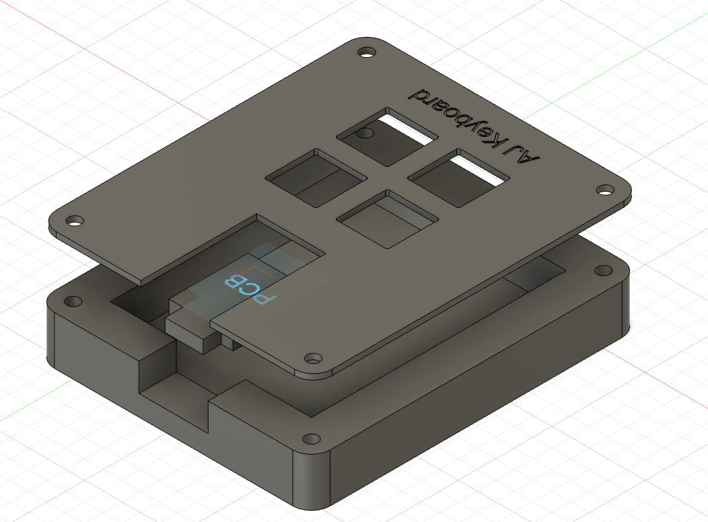
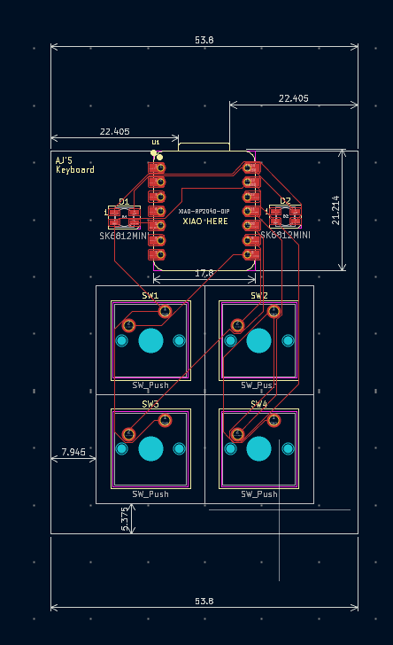

# 4-Key Fun
This is my cutom Hackpad. It has 4 keys and 2 LED's and uses KMK firmware. It is an implementation of my first PCB. 

## Features
- 4 keys
- Grey Minamalist casing
- Dual LED

## CAD

## PCB & Schematic

## BOM 4x 
- Cherry MX Switches
- 2x SK6812 MINI Leds
- 1x XIAO RP2040
- 4x Blank DSA Keycaps
- 4x M3x16 Bolt
- 4x M3 Heatset
- CAD File of Casing
- 

